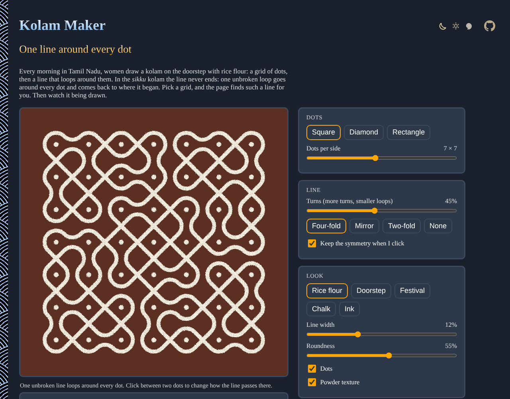

# Kolam-Maker

Generate a South Indian kolam right in your browser: a grid of dots, and a single unbroken line that loops around every one of them and comes back to where it began. Watch it being drawn, change it with a click, and save it as an SVG or a PNG. No sign-up and no libraries.

- [Make a kolam](https://evoluteur.github.io/kolam-maker/)

## What it does

Every morning in Tamil Nadu, women draw a kolam on the doorstep with rice flour. In the *sikku* (or *kambi*) kolam, the line never ends: one closed loop goes around every dot.

- **Dots**: a square grid (2 to 13 dots per side), the classic diamond (1-3-5-7-5-3-1...) or a rectangle.
- **New kolam**: a new design, with a single line, different every time.
- **Turns**: few turns give long diagonal sweeps, many turns give small loops around the dots.
- **Symmetry**: four-fold (turning), mirror, two-fold or none.
- **Click** between two dots to change how the line passes there (crossing, or turning one way or the other). When the design falls apart into several lines, each one gets its own color, and **Make it one line** joins them again.
- **Draw it**: watch the line being drawn in one stroke, at the pace you choose.
- **Look**: rice flour on red earth, a granite doorstep, festival colors, chalk or ink, with the line width, the roundness of the loops, the dots and a powder texture.
- **Save**: **Download PNG** (2000 pixels square) or **Download SVG**. The address of the page keeps the kolam, to share it.

## How it works

A sikku kolam is a *mirror curve*: halfway between two neighboring dots, the line either crosses itself or bounces back as if off a little two-sided mirror, and on the border it always bounces back. Follow it from anywhere and it loops around dot after dot until it comes home. Paulus Gerdes found the same curves in the *sona* sand drawings of Angola, and Slavik Jablan studied them as mirror curves.

To find a single line: with no mirrors, a square of n by n dots holds n separate lines. A mirror where two different lines cross always joins them into one. Where a line crosses itself, one mirror keeps it whole and the other cuts it in two. So the page places mirrors in random order (by symmetric groups of four), keeps only those that never cut, and adds more until one line is left.

## How it is built

Plain HTML, CSS and JavaScript, with no dependencies and no build step. Just open `index.html`. It is also a small installable web app that works offline.

- The kolam is one SVG, and the whole algorithm is in [js/kolam.js](https://github.com/evoluteur/kolam-maker/blob/main/js/kolam.js).
- The three color themes (dark, light and blue) are shared with my other projects, copied from [omg-themes](https://github.com/evoluteur/omg-themes) (`npm run sync:themes` refreshes them).

Kolam-Maker is open source at [GitHub](https://github.com/evoluteur/kolam-maker) with MIT license.

Had fun browsing the app? [Buy me a coffee by becoming a sponsor](https://github.com/sponsors/evoluteur).

You may also be interested in [Celtic-Knot-Maker](https://github.com/evoluteur/celtic-knot-maker) ([demo](https://evoluteur.github.io/celtic-knot-maker/)), which weaves the same mirror curves over and under, and in [Mandala-Maker](https://github.com/evoluteur/mandala-maker) ([demo](https://evoluteur.github.io/mandala-maker/)), [Sri-Yantra](https://github.com/evoluteur/sri-yantra) ([demo](https://evoluteur.github.io/sri-yantra/)) and [Labyrinth-Maker](https://github.com/evoluteur/labyrinth-maker) ([demo](https://evoluteur.github.io/labyrinth-maker/)). For more mystic arts as small web apps, see [Esoterica](https://evoluteur.github.io/esoterica.html).

Copyright (c) 2026 [Olivier Giulieri](https://evoluteur.github.io/).
